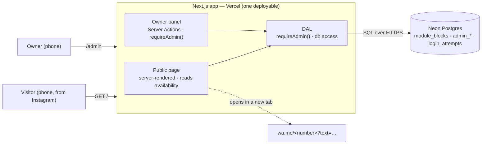

# 03 — Architecture

> How the public landing, the owner panel and the database fit together, the two flows that matter, and what happens when something fails.

## Block diagram

## Components

| Component | Responsibility | Does NOT |
|---|---|---|
| Public page `/` | Renders content from `content/` constants and the availability of the next 12 months; runs the form on the client | Store anything; accept writes |
| Inquiry form (client component) | Validates fields, filters out taken modules, builds the WhatsApp message and URL | Call the server |
| Owner panel `/admin` | Login, month calendar, cross out / restore modules, sign out | Show customer data (none exists) |
| DAL (`lib/dal.ts`) | `requireAdmin()` and every DB read/write. The only module that imports the DB client | Render UI |
| `proxy.ts` | Redirects `/admin/*` to `/admin/login` when the session cookie is absent (optimistic) | Decide access; query the DB |
| Neon | Holds availability, the credential hash, sessions, login attempts, audit | — |

## Flow 1 — Inquiry to WhatsApp

1. The visitor picks a date. Taken modules for that date are shown disabled; "Día completo" is disabled if either module is taken.
2. The visitor fills in the fields (`06-UI-UX.md` §4) and taps "Enviar consulta por WhatsApp".
3. The client validates with the zod schema, builds the message (`05-API-CONTRACTS.md` §3) and opens `https://wa.me/<NEXT_PUBLIC_WHATSAPP_NUMBER>?text=<encoded>` in a new tab.
4. The page shows the handoff status panel with a fallback link in case the tab did not open.

**Nothing reaches the server.** The visitor still sends the message themselves from WhatsApp, which is the confirmation step.

## Flow 2 — Owner crosses out a module

1. The owner opens `/admin`. Without a session cookie, `proxy.ts` redirects to `/admin/login`.
2. Login is a Server Action: rate limits → honeypot and time trap → scrypt verify → new session row → `__Host-` cookie (`08-SECURITY.md`).
3. In the month view the owner taps a day and chooses **Mediodía**, **Noche** or **Día completo**.
4. `blockModules` runs: `requireAdmin()` → zod → one `INSERT` of one or two rows. A conflict returns `ALREADY_TAKEN`. Then an audit row and revalidation of the availability tag.
5. The public page shows the change on its next render.

## The midnight rule

- The night module runs **19:00 → 02:00 of the next day** but belongs to the **date it starts**. It is stored as `(D, 'noche')`.
- The next day's `mediodia` (10:00) does not overlap it, so there is no cross-date check.
- Display always says "Noche · 19:00 a 02:00 hs" under the start date.
- **"Today"** is computed in `America/Argentina/Buenos_Aires`, never in UTC. A visitor at 23:30 must not be offered yesterday.

## Rendering and caching

| Surface | Rendering | Cache |
|---|---|---|
| `/` | Static shell + streamed dynamic part (Cache Components, `D-021`) | `getAvailability(today)` is cached under the tag `availability` with the `hours` profile; every `blockModules` / `unblockModule` calls `updateTag("availability")`, so the change shows on the next request (verified in WU-05). Content constants are static |
| `/admin/*` | Dynamic, per request | **No cache**. Responses carry `Cache-Control: no-store` |

## State placement

| State | Lives in |
|---|---|
| Form fields, selected date and module | Client component state (lost on reload — acceptable) |
| Availability | Neon `module_blocks` |
| Session | Neon `admin_sessions` + `HttpOnly` cookie |
| Prices, amenities, texts | `content/` constants in the repo (`D-009`) |

## Failure modes

| Failure | What the visitor / owner sees | Mitigation |
|---|---|---|
| Neon unreachable while rendering `/` | The calendar shows "No pudimos cargar la disponibilidad — consultanos igual por WhatsApp"; the form still works without filtering | The availability read is wrapped; the page never 500s because of it |
| The WhatsApp tab does not open (popup blocked) | The status panel shows a visible link to the same URL | Handoff status panel (`06-UI-UX.md` §4.3) |
| WhatsApp not installed on desktop | `wa.me` opens WhatsApp Web | None needed |
| The owner forgets to cross out a booked module | The public calendar offers a taken module; the visitor asks by WhatsApp anyway | Client commitment `CI-03`. A stale calendar is worse than no calendar |
| Brute force on the login | "Demasiados intentos. Probá de nuevo más tarde." | Per-IP and global limits (`08-SECURITY.md` §5) |
| Server Action ID changed after a deploy ("Failed to find Server Action") | The panel shows "Se actualizó la página, reintentá" | Treated as retryable in `error.tsx` |
| Owner lost the phone with an open 30-day session | — | Rotating the password invalidates every session (`08-SECURITY.md` §6) |

## Alternatives Considered

| Option | Verdict |
|---|---|
| **Store availability as `(date, module)`** | **Chosen (`D-003`).** Matches how the client sells; midnight is a display concern; uniqueness is one constraint |
| Store time ranges (`starts_at`, `ends_at`) | **Rejected.** The client sells fixed modules; free ranges would need a price rule nobody has, plus overlap exclusion constraints |
| Google Calendar as the availability backend | **Rejected by Mateo** in favour of an own panel |
| Store each inquiry in the DB before opening WhatsApp | **Rejected for phase 1.** It adds an anonymous write surface (spam, PII, retention) for no requirement |
| Separate admin app / subdomain | **Rejected.** One owner and one screen do not justify a second deployable |
